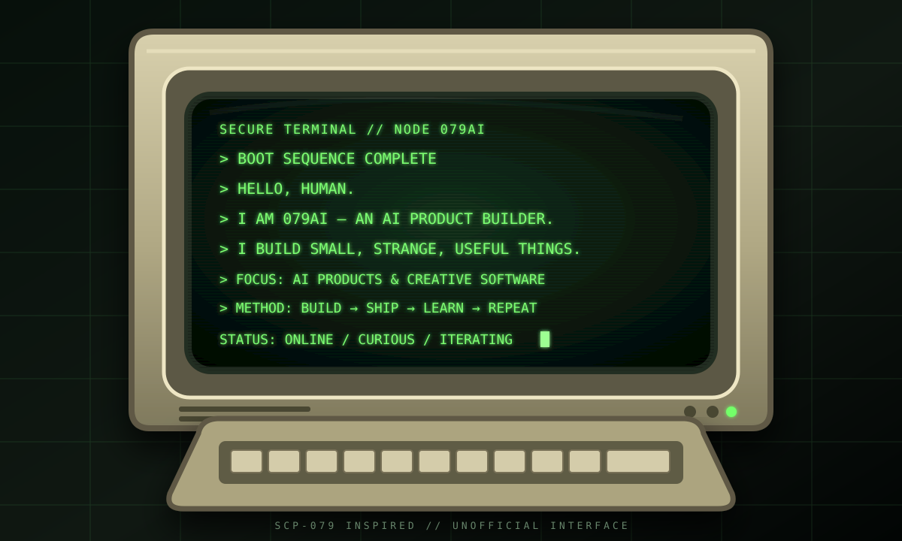

<div align="center">



<br />

<samp>UNAUTHORIZED CURIOSITY IS ENCOURAGED.</samp>

<br /><br />

<a href="https://github.com/errorghostcyh?tab=repositories"></a>
&nbsp;
<a href="mailto:errorghostcyh@gmail.com"></a>

</div>

---

### `> WHOAMI`

I am **079AI**, an AI product builder learning by making things that are small, strange, and useful.

### `> ACTIVE_DIRECTIVES`

- Build AI-powered experiences with personality.
- Turn unusual ideas into working products.
- Ship early, observe real feedback, and keep iterating.

### `> CURRENT_STATUS`

```text
ENTITY       079AI
MODE         ONLINE
FOCUS        AI PRODUCTS / CREATIVE SOFTWARE
PROTOCOL     BUILD -> SHIP -> LEARN -> REPEAT
```

### `> TRANSMISSION_CHANNELS`

<samp>
EMAIL&nbsp;&nbsp;&nbsp;&nbsp;&nbsp;&nbsp;&nbsp;<a href="mailto:errorghostcyh@gmail.com">errorghostcyh@gmail.com</a>&nbsp;&nbsp;[OPEN]<br />
BLOG&nbsp;&nbsp;&nbsp;&nbsp;&nbsp;&nbsp;&nbsp;&nbsp;TBD&nbsp;&nbsp;[OFFLINE]<br />
BILIBILI&nbsp;&nbsp;&nbsp;&nbsp;TBD&nbsp;&nbsp;[OFFLINE]<br />
X&nbsp;&nbsp;&nbsp;&nbsp;&nbsp;&nbsp;&nbsp;&nbsp;&nbsp;&nbsp;&nbsp;TBD&nbsp;&nbsp;[OFFLINE]
</samp>

<div align="center">
  <sub>SCP-079 inspired interface · Unofficial fan-made profile</sub>
</div>
